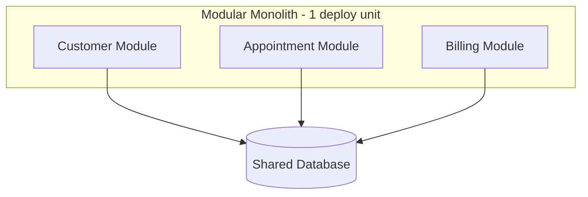
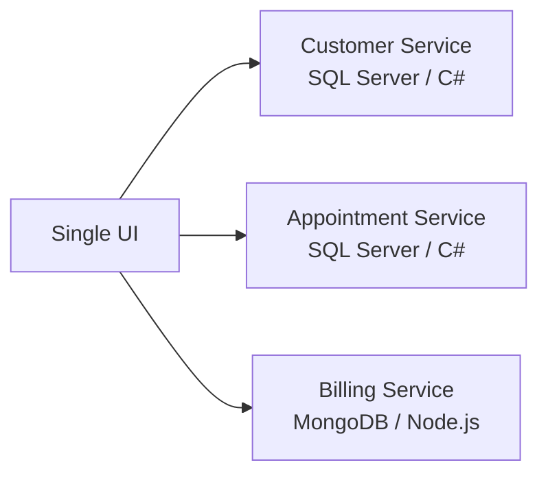

# Bài học: Vì sao chúng ta nói về Microservices (và khi nào đừng dùng nó)

> Chương 1 — Introducing Microservices
> Ví dụ xuyên suốt: Hệ thống quản lý phòng khám (Healthcare Management System)

---

## Phần 1: Câu chuyện bắt đầu từ đâu — nỗi đau của Monolith

Hồi mới ra trường, hầu như ai cũng bắt đầu với một dạng ứng dụng: tất cả gói gọn trong một project ASP.NET. UI, business logic, data access — tất cả sống chung một nhà, một process, một database. Đây gọi là **monolith**.

Không có gì sai khi bắt đầu như vậy cả. Thật ra đây là cách đúng đắn nhất để launch một sản phẩm mới — nhanh, đơn giản, dễ debug vì mọi thứ nằm trong cùng một call stack.

Vấn đề chỉ xuất hiện khi ứng dụng **lớn lên**. Và nó lớn lên theo một kịch bản rất quen thuộc:

- Bạn chỉ sửa một dòng ở module Billing, nhưng để deploy, bạn phải build lại và test lại **toàn bộ** ứng dụng — kể cả module Appointment chẳng liên quan gì.
- Module Booking đang bị quá tải vào giờ cao điểm, nhưng vì mọi thứ nằm chung một process, bạn không thể chỉ scale riêng Booking — bạn phải nhân bản **toàn bộ** ứng dụng, kể cả những phần không cần scale, gây lãng phí tài nguyên.
- Sau 2-3 năm, không ai còn dám động vào một số phần code cũ vì sợ "đụng đâu vỡ đó" — dependency chồng chéo, spaghetti code hình thành dần dần dù không ai cố ý.

Đây chính là ba cơn đau kinh điển: **scaling khó**, **deploy là một cục nghẽn (bottleneck)**, và **nợ kỹ thuật (technical debt) chồng chất**. Bất kỳ ai làm việc trên một hệ thống sống lâu năm đều đã từng trải qua ít nhất một trong ba điều này.

---

## Phần 2: Bước đệm ít ai nói tới — Modular Monolith

Trước khi nhảy thẳng vào microservices, có một bước trung gian rất quan trọng mà nhiều đội nhóm bỏ qua: **modular monolith**.

Ý tưởng đơn giản: bạn vẫn deploy một khối duy nhất, nhưng bên trong, bạn tổ chức code thành các **module tách biệt rõ ràng** theo domain nghiệp vụ — Customer module, Billing module, Appointment module — mỗi module có business logic và data access riêng, không được phép "thò tay" vào code của module khác.

Cái hay của bước này là nó cho bạn kỷ luật về ranh giới domain (giống hệt microservices) mà không phải trả giá vận hành của một hệ thống phân tán thật sự. Rất nhiều công ty công nghệ lớn — Shopify là một ví dụ nổi tiếng — đã công khai chia sẻ rằng họ chạy modular monolith ổn định ở quy mô rất lớn, và chỉ tách phần nào đó thành service riêng khi có lý do cụ thể, chứ không tách tất cả.

Nhưng modular monolith vẫn còn hai giới hạn: bạn **không scale riêng lẻ được từng module**, và bạn **vẫn bị ràng buộc vào một công nghệ, một database duy nhất**. Nếu module Billing cần một loại database khác hẳn (ví dụ document database cho dữ liệu bán cấu trúc), bạn không làm được trong mô hình này.

Đây là lúc microservices bước vào cuộc chơi.

---

## Phần 3: Microservices thực sự nghĩa là gì

Định nghĩa hay nhất mà tôi từng nghe: **microservices là những service nhỏ, tự trị (autonomous), cùng nhau hoạt động**. Chữ quan trọng nhất ở đây là **tự trị** — không phải "nhỏ".

Nhiều bạn junior hiểu sai rằng microservices là "chia code thành nhiều file nhỏ, nhiều project nhỏ". Không phải. Bản chất của nó là: mỗi service có thể được **phát triển, test, deploy, và scale hoàn toàn độc lập** với các service khác — kể cả dùng ngôn ngữ, database, đội ngũ khác nhau.

Ba lợi ích cốt lõi:

**1. Scale đúng chỗ cần scale.** Ví dụ kinh điển: một phòng khám mở đợt tiêm chủng miễn phí, lượng người đặt lịch tăng đột biến. Với microservices, bạn chỉ cần scale riêng Appointment Service và Billing Service — Customer Service (ít bị ảnh hưởng) giữ nguyên. Tiết kiệm tài nguyên, tiết kiệm chi phí cloud thực sự.

**2. Công nghệ đa dạng đúng nhu cầu.** Module quản lý khách hàng cần transaction chặt chẽ → SQL Server hợp lý. Module thanh toán có dữ liệu linh hoạt, cần throughput cao → có thể hợp với MongoDB hơn. Trong monolith, bạn bị khóa cứng vào một loại database cho tất cả. Trong microservices, mỗi service tự quyết.

**3. Team tự chủ (team autonomy).** Đây là điểm nhiều bạn junior không để ý nhưng lại là động lực lớn nhất trong thực tế doanh nghiệp: khi một team sở hữu trọn vẹn một service từ code tới deploy tới vận hành, họ không còn phải chờ team khác merge code hay xếp lịch release chung. Đây chính là lý do các công ty như Netflix, Amazon, Uber đẩy mạnh mô hình này — không chỉ vì lý do kỹ thuật thuần túy, mà vì nó cho phép **hàng trăm team làm việc song song** mà không giẫm chân nhau.

---

## Phần 4: Cách "cắt" một hệ thống thành các service — đây là kỹ năng khó nhất

Đây là phần mà tôi thấy junior dev hay lúng túng nhất: biết microservices là gì rồi, nhưng không biết **cắt ở đâu**.

Lấy ví dụ một hệ thống quản lý phòng khám. Yêu cầu nghiệp vụ:
- Khách hàng có hồ sơ cá nhân
- Khách hàng đặt lịch khám với bác sĩ theo khung giờ trống
- Sau khi đặt, lịch của bác sĩ chuyển từ "trống" sang "đã đặt"
- Sau buổi khám, hệ thống tạo hóa đơn
- Khách hàng thanh toán online hoặc tại quầy

Từ đây, ta xác định được các module nghiệp vụ: **User Profile**, **Appointment Scheduling**, **Doctor's Calendar**, **Billing**, **UI**, **Data Storage**.

Câu hỏi kế tiếp: monolith hay microservices? Đây là lúc tôi luôn hỏi ngược lại nhóm của mình 5 câu, chứ không quyết định cảm tính:

1. **Quy mô và độ phức tạp của ứng dụng** — Nhỏ và ổn định thì monolith vẫn tốt hơn. Đừng vì "cho ngầu" mà chọn microservices.
2. **Cấu trúc và kinh nghiệm của team** — Team 3 người chưa từng vận hành distributed system? Microservices sẽ giết chết tốc độ phát triển của bạn trong 6 tháng đầu, không phải giúp bạn nhanh hơn.
3. **Nhu cầu scale thực tế** — Có traffic tăng đột biến theo mùa, theo sự kiện không? Nếu có, microservices + cloud auto-scaling là lợi thế rõ ràng.
4. **Nhu cầu đa dạng công nghệ** — Có module nào thực sự cần công nghệ khác biệt hẳn không, hay chỉ là "muốn thử cho vui"?
5. **Mức độ sẵn sàng về tổ chức** — Team đã quen với Agile, DevOps, CI/CD tự động chưa? Nếu chưa, hãy giải quyết cái này trước khi nghĩ tới microservices.

Nếu quyết định đi microservices, bạn dùng **Domain-Driven Design** (chủ đề của Chapter 2) để xác định ranh giới — mỗi service ánh xạ vào một bounded context, một domain nghiệp vụ rõ ràng. Ví dụ ở đây: Customer Service, Appointment Service, Billing Service.

Và đây là điểm quan trọng cần khắc ghi: **mỗi service có database riêng**. Điều này gần như là nguyên tắc bất di bất dịch trong microservices thực chiến. Vì sao? Vì nếu hai service dùng chung một database, bạn đã vô tình tạo ra coupling ẩn — một migration schema của team A có thể âm thầm phá vỡ code của team B mà không ai hay biết cho tới khi production báo lỗi.

Hệ quả tất yếu: dữ liệu bị **trùng lặp có chủ đích**. Ví dụ, thông tin khách hàng cần xuất hiện ở cả Appointment Service lẫn Billing Service — mỗi service giữ một bản sao cần thiết cho nghiệp vụ của mình, đồng bộ qua sự kiện (event), chứ không join trực tiếp qua database.

---

## Phần 5: Cái giá bạn phải trả — và đây là phần hay bị bỏ qua nhất

Đây là phần tôi luôn nhấn mạnh với junior, vì phần này quyết định bạn có sống sót ở production hay không.

### Vấn đề data consistency

Trong monolith, một luồng đặt lịch — kiểm tra khách hàng, kiểm tra slot trống, tạo hóa đơn, thu tiền, xác nhận lịch — là **một transaction SQL duy nhất**. Hoặc thành công tất cả, hoặc rollback tất cả. Đơn giản, an toàn.

Trong microservices, luồng đó đi qua 3-4 service khác nhau, qua network, không còn transaction chung nữa. Nếu bước tạo hóa đơn thành công nhưng bước xác nhận lịch thất bại (network timeout chẳng hạn), bạn có một hóa đơn "mồ côi" — dữ liệu không nhất quán.

Đây chính là lý do những pattern như **Saga Pattern** ra đời — dùng để điều phối các bước, và khi một bước thất bại, chủ động "bù trừ" (compensate) các bước trước đó, thay vì rollback tự động như SQL transaction. Đây sẽ là chủ đề chuyên sâu ở các chương sau, nhưng bạn cần hiểu ngay từ bây giờ: **transaction boundary của bạn không còn giống monolith nữa** — đây là thay đổi tư duy lớn nhất khi chuyển sang microservices.

### Vấn đề availability

Microservices giúp giảm single point of failure — một service chết không nhất thiết kéo sập cả hệ thống. Nhưng có một cạm bẫy: nếu bạn dùng **API Gateway** làm cổng vào duy nhất (rất phổ biến, và nên dùng), thì bản thân Gateway đó lại trở thành single point of failure mới, chỉ là ở tầng cao hơn. Gateway phải luôn có nhiều instance, load balanced, health-checked liên tục — không được xem nhẹ.

### Vấn đề Monitoring — cái mà junior hay coi nhẹ nhất

Trong monolith, khi có lỗi, bạn mở log file, tìm stack trace, xong. Trong microservices, một request đi qua 5 service, mỗi service có log riêng nằm ở 5 nơi khác nhau. Nếu bạn không có **centralized logging** và **distributed tracing** (dùng OpenTelemetry là chuẩn công nghiệp hiện tại, được hỗ trợ tốt trên Azure, AWS, GCP) ngay từ ngày đầu, bạn sẽ debug production issue lúc 2 giờ sáng mà không biết bắt đầu tìm từ đâu.

Đây là lời khuyên tôi luôn nói với các bạn mới: **đừng để observability là thứ "làm sau"**. Build nó song song với service đầu tiên, không phải khi hệ thống đã có 10 service và bạn mới nhận ra mình mù thông tin.

### Vấn đề Deployment

Mỗi service cần độc lập deploy và scale — lý tưởng nhất là đóng gói thành container (Docker), vận hành bởi một orchestrator như Kubernetes để tự động khởi động đúng container, đúng thời điểm, xử lý lỗi khi container chết. Xu hướng gần đây còn có thêm serverless (AWS Lambda, Azure Functions) — phù hợp cho các service nhẹ, xử lý nền, không cần quản lý hạ tầng thủ công.

---

## Phần 6: Vì sao chọn .NET cho hành trình này

Một vài lý do thực tế, không phải quảng cáo:

- **Cross-platform thật sự** — .NET hiện chạy tốt trên Windows, macOS, Linux, quan trọng vì hầu hết container production chạy trên Linux.
- **Hiệu năng cao** — .NET hiện đại (bản LTS mới nhất là .NET 10, hỗ trợ dài hạn tới 2028) được tối ưu tốt cho khối lượng request lớn, điều microservices cần.
- **Modular, nhẹ** — bạn chỉ cần include đúng package cần thiết cho từng service, giữ container nhỏ gọn, khởi động nhanh.
- **Hệ sinh thái container tốt** — tích hợp mượt với Docker, hỗ trợ tốt cho orchestration.
- **Thư viện hỗ trợ resilience** — ví dụ Polly, giúp xử lý retry, circuit breaker khi một service gọi service khác mà gặp lỗi tạm thời (transient fault) — cực kỳ cần thiết trong môi trường network không ổn định của distributed system.

---

## Phần 7: Ba cái bẫy tôi thấy junior dev hay rơi vào nhất

1. **"Distributed Monolith"** — Tách thành nhiều service nhưng vẫn share chung một database, hoặc service này luôn phải gọi đồng bộ, đúng thứ tự tới service kia mới xong việc. Kết quả: bạn nhận đủ mọi nhược điểm của microservices (network latency, deploy phức tạp) mà không có được lợi ích thật sự nào.

2. **Nhảy vào microservices quá sớm** — Team nhỏ, sản phẩm mới, chưa có CI/CD trưởng thành, nhưng đã chia thành 10 service vì "nghe nói đây là chuẩn công nghiệp". Chi phí vận hành sẽ ăn hết năng suất phát triển tính năng thật sự.

3. **Coi nhẹ observability** — Đã nói ở trên, nhưng đáng nhắc lại vì đây là nguyên nhân số một khiến các đội nhóm "sợ" microservices sau khi triển khai thất bại: không phải vì kiến trúc sai, mà vì họ không nhìn thấy được điều gì đang xảy ra bên trong hệ thống.

---

## Tổng kết chương

Chương 1 thiết lập nền tảng tư duy: monolith không sai, chỉ là có giới hạn khi hệ thống lớn lên. Modular monolith là bước đệm hợp lý trước khi tách microservices thật sự. Microservices mang lại khả năng scale độc lập, đa dạng công nghệ, và team tự chủ — nhưng đổi lại là cái giá về data consistency, availability, monitoring, và deployment phức tạp hơn hẳn. Quyết định đi microservices hay không phải dựa trên 5 tiêu chí thực tế (quy mô, team, nhu cầu scale, nhu cầu công nghệ, mức độ sẵn sàng tổ chức), không phải theo trend.

Chương tiếp theo sẽ đi sâu vào Domain-Driven Design — công cụ chính thức để xác định ranh giới service (bounded context) một cách có hệ thống, thay vì cảm tính.
